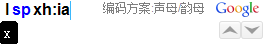
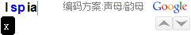

shuangpin.google
----------------

Query shuangpin scheme in [google pinyin][ggime].

Installation
------------

Double click to install.

Usage
-----

Type `sp` in google pinyin `i mode` to active shuangpin query.
The default scheme is “小鹤双拼”. As google pinyin does not provide
the method to get the current scheme, you need to modify `_DEFAULT_SCHEME`. The code for different scheme is as follows,

| 小鹤 | 自然码 | 智能ABC | 拼音加加 | 紫光拼音 | 微软拼音 |
|:----:|:-----:|:-------:|:-------:|:--------:|:-------:|
|  xh  |  zr   |   zn    |   jj    |    zg    |    ms   |

You could use both `韵母` or `方案:韵母` to query.

[ggime]: https://www.google.com/intl/zh-CN/ime/pinyin/
